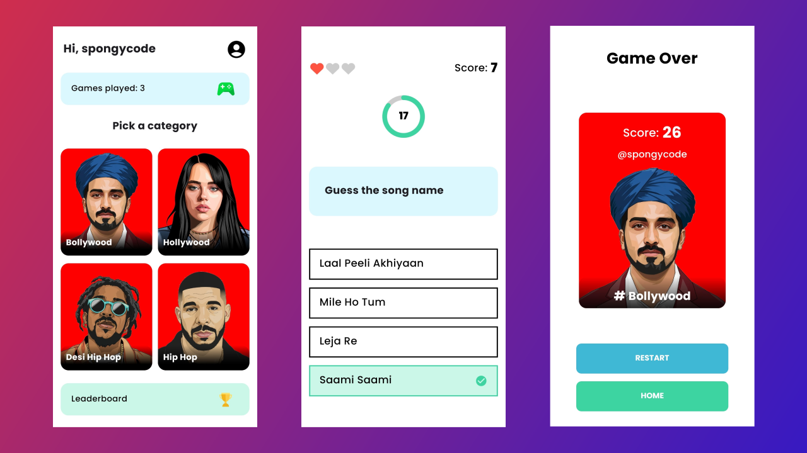

<div align="center">
    
    <h1>Song Quest 🎶</h1>
    <p>A fully functional Android quiz game featuring audio challenges, leaderboards, and multiple categories.</p>
</div>

## Features 🌟
### Authentication
- <b>Login:</b> Users can securely log in to their accounts.
- <b>Registration:</b> New users can easily create accounts to start playing.
- <b>Password Reset:</b> Reset your password through the app, and a one-time password will be sent to your email.
### Gameplay
- <b>Guess the Answer:</b> Test your knowledge by guessing the correct answer listening the audio.-
- <b>Multiple Categories:</b> Choose from various exciting categories, each with tailored questions for an engaging gameplay experience.
- <b>Limited Attempts:</b> You have limited wrong attempts in each game play.
- <b>Leaderboard:</b> Compete with others and view the consistent leaderboard based on the highest scores.
- <b>Game History:</b> Track your progress by reviewing the history of games you've played.
### Profile
- <b>Update Profile:</b> Customize your profile details in the basic settings.


## Screenshots 📷
<p align="center">  



</p>

## Video Preview 📹

[](https://github.com/spongycode/song-quest/assets/65273165/08f1f156-683c-49bd-9451-53132774e2b9)


## App Flow & Architecture 👷‍♂️
<p align="center">  

</p>

## Tech Stack 🛠️
- <b>[Kotlin](https://kotlinlang.org/):</b> Primary language for Android app development.
- <b>[NextJS API Backend](https://nextjs.org/docs/pages/building-your-application/routing/api-routes):</b> Utilizes NextJS for a powerful and flexible backend. See <b>[here](https://github.com/spongycode/song-quest-backend)</b> for implementation details.
- <b>[Firebase](https://firebase.google.com/):</b> Used for storing audio files, providing a scalable and reliable cloud storage solution.
- <b>[MongoDB](https://www.mongodb.com/):</b> Employed for a NoSQL database, handling normal query data storage efficiently.
- <b>[Clean Architecture Pattern](https://developer.android.com/topic/architecture):</b> Organizes code into distinct layers (UI, Domain, Data) for modularity and maintainability in Android app development.
- <b>[MVVM](https://developer.android.com/topic/libraries/architecture/viewmodel):</b> Architecture pattern (Model-View-ViewModel) for a structured and maintainable app design.
- <b>[Hilt](https://developer.android.com/training/dependency-injection/hilt-android):</b> Simplifies dependency injection in Android apps.
- <b>[Ktor client](https://ktor.io/docs/getting-started-ktor-client.html):</b> Facilitates asynchronous client-server communication.
- <b>[Jetpack Compose](https://developer.android.com/jetpack/compose):</b> Declarative UI toolkit for native Android apps.
- <b>[Compose Navigation](https://developer.android.com/jetpack/compose/navigation):</b> Navigation component for Jetpack Compose.
- <b>[Material 3](https://m3.material.io/):</b> Latest Material Design system for unified app aesthetics.
- <b>[Datastore](https://developer.android.com/topic/libraries/architecture/datastore):</b> Modern local data storage solution.


## Installation
[](https://github.com/spongycode/song-quest/releases/latest)


## Backend details

### Routes `api/mobile`
- <b>`/gameplay`</b>
    - `/create`: Create a new game.
    - `/question`: Upload new questions and fetch questions category-wise.
    - `/check`: Check the correct answer for the question.
    - `/highscore`: Fetch the leaderboard category-wise.
    - `/history`: Fetch the user's game history.
    - `/save`: Save the game.
- <b>`/users`</b>
    - `/register`: Register new users.
    - `/login`: Login users.
    - `/profile`: Get and update profile details.
    - `/resetPassword`: Reset password and send OTP via email.


### Data Models

- <b> Game Model</b>

```json
{
  "game": {
    "player": "String (required)",
    "score": "Number (default: 0.0)",
    "accurate": "Number (default: 0)",
    "questionsId": "Array of ObjectId (ref: 'Question')",
    "category": "String (required)",
    "isGameSaved": "Boolean (default: false)",
    "createdAt": "Date (default: Current timestamp)",
    "expireAt": "Date (default: Current timestamp)"
  }
}
```
**Note:** This project utilizes a <b>[TTL (Time-to-Live) index](https://www.mongodb.com/docs/manual/core/index-ttl/)</b> to <b>automatically delete unsaved games</b> after `300 seconds`. The index is based on the `expireAt` field and is configured to delete games where `isGameSaved` is false. This ensures efficient cleanup of temporary data.
- <b>Question Model</b>

```json
{
  "question": {
    "title": "String (required)",
    "songUrl": "String",
    "options": [
      {
        "optionid": "Number (required)",
        "value": "String (required)"
      }
    ],
    "correctOptionId": "Number (required)",
    "category": "String (required)",
    "totalAttempts": "Number (default: 0)",
    "difficulty": "Number (default: 0.5)",
    "altText": "String (default: '')",
    "createdAt": "Date (default: Current timestamp)"
  }
}
```
- <b>User Model</b>
```json
{
  "user": {
    "username": "String (required, unique, trim)",
    "email": "String (required, unique, trim)",
    "imageUrl": "String",
    "password": "String (required, 'Password is required')",
    "gamesPlayed": "Number (default: 0)",
    "forgotPasswordToken": "String",
    "forgotPasswordTokenExpiry": "Date",
    "refreshToken": "String",
    "createdAt": "Date (default: Current timestamp)"
  }
}
```

### Scoring
The score for each question is determined using the formula below.

<div align="center">  

```math
score = max(0, -0.00057 \times timeTaken^3 + 0.037 \times timeTaken^2 - 0.96 \times timeTaken + 10)
```


</div>


## Getting Started 🚀
To begin using Song Quest, clone the repository and open the project in Android Studio. Clone the backend server from [here](https://github.com/spongycode/song-quest-backend) and fill up the required environment variables mentioned in the `sample.env` file to set up your own server.


## Contributing 🤝
Feel free to contribute to this project by submitting issues, pull requests, or providing valuable feedback. Your contributions are always welcome! 🙌

## License 📄
Song Quest is released under the [MIT License](https://opensource.org/licenses/MIT). Feel free to modify or add to this list based on the specific features of your app.

## Happy coding! 🎉👩‍💻👨‍💻
